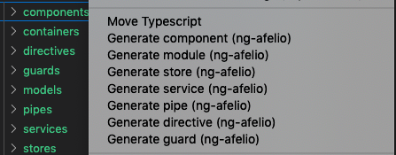

# NG Afelio

This is the VS Code extension of `ng-afelio` CLI.

## Features

* install ngx-translate
* install mock system
* *install NGXS (comming soon)*
* *install OIDC (comming soon)*

* generate module
* generate component
* generate store
* generate mock
* generate service
* *generate pipe (comming soon)*
* *generate guard (comming soon)*
* *generate directive (comming soon)*

* check env files

* check i18n files

## Requirements

This extension can only be used on projet that contains `ng-afelio` in version `2.0.0` or more.
If it's not the case, use `ng add ng-afelio`. 

The extension will help you to install the CLI.

If you have an older version you have to upgrade manually.

## Extension Settings

This extension contributes the following settings:

* `ng-afelio.when-cli-not-found`: set to `off` to disable CLI install message.

## Known Issues

No known issues

## Release Notes

### 0.0.1

Initial release that contains:

* generate module
* generate component
* generate store
* generate mock
* check env files
* check i18n files
* install ngx-translate
* install mock system

<!-- ### 1.0.0

Initial release of ...

### 1.0.1

Fixed issue #.

### 1.1.0

Added features X, Y, and Z. -->

-----------------------------------------------------------------------------------------------------------

<!-- ## Working with Markdown

**Note:** You can author your README using Visual Studio Code.  Here are some useful editor keyboard shortcuts:

* Split the editor (`Cmd+\` on macOS or `Ctrl+\` on Windows and Linux)
* Toggle preview (`Shift+CMD+V` on macOS or `Shift+Ctrl+V` on Windows and Linux)
* Press `Ctrl+Space` (Windows, Linux) or `Cmd+Space` (macOS) to see a list of Markdown snippets

### For more information

* [Visual Studio Code's Markdown Support](http://code.visualstudio.com/docs/languages/markdown)
* [Markdown Syntax Reference](https://help.github.com/articles/markdown-basics/) -->

**Enjoy!**
